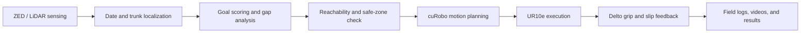

# Date Harvesting Manipulation

Professional ROS 2 workspace for selective date-palm harvesting with a UR10e
manipulator, cuRobo motion planning, ZED vision, LiDAR-assisted scene capture,
and a Delto 3-finger gripper.

This repository is the integration point for field-ready harvesting experiments:
goal localization, safe motion planning, operator supervision in RViz, gripper
control, grasp/slip feedback, and data collection workflows used during KAUST
farm testing.

> Field videos and experiment evidence are kept as KAUST GitLab work-item
> uploads rather than committed as large binary files.

## System Snapshot

| Layer | What it provides |
| --- | --- |
| Manipulator | UR10e control through ROS 2 control and the Universal Robots driver. |
| Planning | cuRobo GPU planning, safe-zone constraints, reachability clouds, and short-path regrip motions. |
| Perception | ZED date localization, trunk detection, depth fusion, gap analysis, and camera calibration profiles. |
| End effector | Delto gripper integration with grasp commands, force feedback, grip checks, and slip analysis. |
| Operator UI | RViz panel for launch workflow, goals, monitoring, camera capture, heat/current status, LiDAR scan, and safe-zone controls. |
| Field data | Videos, screenshots, bags, camera recordings, and stability logs for harvesting validation. |

## Field Results

Recent KAUST outdoor tests focused on making the harvesting workflow practical
outside the lab: selecting reachable goals, moving safely near real bunches,
checking grip quality, and documenting success, weak-grip, and slip cases.

| Experiment | Evidence | Result / takeaway |
| --- | --- | --- |
| KAUST Field Test, 2 July 2026 | [Work item #74](https://gitlab.kaust.edu.sa/dsa-kaust/projects/date-palm-automation/-/issues/74#note_88034) | Safety-envelope and range-of-motion testing around selected trees. |
| Farm experiment attempts | [Videos in #74](https://gitlab.kaust.edu.sa/dsa-kaust/projects/date-palm-automation/-/issues/74#note_88849) | Six labeled harvesting attempts: three success labels, one weak-grip case, and two slipped cases for gripper tuning. |
| 16 July 2026 field experiment | [Video in #74](https://gitlab.kaust.edu.sa/dsa-kaust/projects/date-palm-automation/-/issues/74#note_89123) | Additional outdoor motion evidence for gripper motion planning and harvesting workflow review. |
| 22 July 2026 field experiment | [Video in #74](https://gitlab.kaust.edu.sa/dsa-kaust/projects/date-palm-automation/-/issues/74#note_89252) | Additional 720p field video for approach behavior, grip alignment, and workflow validation. |
| Date harvesting development | [Technique update #17](https://gitlab.kaust.edu.sa/dsa-kaust/projects/date-palm-automation/-/issues/17#note_89254) | Consolidates field videos for regrip logic, proper grip checks, slip detection, and harvesting reliability. |
| Y2 field testing | [Data-collection update #15](https://gitlab.kaust.edu.sa/dsa-kaust/projects/date-palm-automation/-/issues/15#note_89253) | Tracks the field videos as part of Y2 outdoor testing and data collection. |

## Harvesting Pipeline



## What This System Can Do

- Localize date targets and trunk obstacles from RGB/depth sensing.
- Score candidate fruit goals and expose selected targets to the operator.
- Visualize reachability clouds and safe-zone boxes before motion execution.
- Plan bounded UR10e motions with cuRobo for outdoor harvesting.
- Execute gripper approach, grasp, regrip, and dropoff workflows.
- Record field evidence through RViz camera capture, logs, videos, and issue-linked results.
- Compare successful grasps against weak-grip and slipped cases to improve harvesting reliability.

## Start Here

For day-to-day robot operation, use the operator guide:

- [UR10e Operator Guide](ur_ws_new/src/ur10e_curobo/OPERATOR_GUIDE.md)

For package-level launch and configuration details:

- [UR10e cuRobo Package README](ur_ws_new/src/ur10e_curobo/readme.md)

For common install/runtime problems:

- [Troubleshooting Guide](troubleshoot.md)

## Documentation Map

Core system docs:

- [UR10e Operator Guide](ur_ws_new/src/ur10e_curobo/OPERATOR_GUIDE.md) - RViz workflow, reachability goals, safe zone, LiDAR scan, camera recording, troubleshooting.
- [UR10e cuRobo Package README](ur_ws_new/src/ur10e_curobo/readme.md) - launch commands, manual launch, UR pendant instructions, keyboard controls.
- [Codebase Architecture](ur_ws_new/src/ur10e_curobo/CODEBASE_ARCHITECTURE.md) - high-level package architecture.
- [Goals Architecture](ur_ws_new/src/ur10e_curobo/GOALS_ARCHITECTURE.md) - goal and harvesting pipeline organization.
- [Motion Control / Collision Avoidance](ur_ws_new/src/ur10e_curobo/C1_4_MOTION_CONTROL_COLLISION_AVOIDANCE_UPDATED.md) - planning and collision behavior.
- [Latency Analysis](ur_ws_new/src/ur10e_curobo/C1_5_LATENCY_ANALYSIS.md) - timing notes.
- [Harvesting Strategy](ur_ws_new/src/ur10e_curobo/E1_4_PROGRAMMED_HARVESTING_STRATEGY_UPDATED.md) - programmed harvesting approach.

Related package docs:

- [ZED Date Detector README](ur_ws_new/src/zed_date_detector/README.md)
- [UR Robot Driver README](ur_ws_new/src/ur_robot_driver/README.md)
- [UR Driver ROS Interface](ur_ws_new/src/ur_robot_driver/ur_robot_driver/doc/ROS_INTERFACE.md)
- [Delto ROS 2 README](ur_ws_new/src/DELTO_ROS2/README.md)
- [cuRobo README](curobo/README.md)

## Repository Layout

```text
.
├── bin/                         # Repo-managed launch/setup helper commands
├── curobo/                      # cuRobo source/vendor tree
├── ur_ws_new/                   # Main ROS 2 Humble workspace
│   ├── fastdds_config.xml       # FastDDS buffer profile
│   └── src/
│       ├── ur10e_curobo/        # Main UR10e/cuRobo harvesting package
│       ├── rviz_ur10e_panel/    # RViz operator panel plugin
│       ├── ur_robot_driver/     # UR driver source with local changes
│       ├── DELTO_ROS2/          # Delto gripper driver
│       └── zed_date_detector/   # ZED/date detector package
├── troubleshoot.md              # Runtime/build troubleshooting guide
└── README.md                    # This file
```

## Main Capabilities

- UR10e control through ROS 2 control and the UR robot driver.
- cuRobo GPU motion planning for joint-space and Cartesian motions.
- RViz operator panel with tabs for motion, goals, monitoring, camera, heat, and settings.
- Reachability cloud for clicking known-good goals from the current posture.
- Safe-zone walls and path validation for bounded in-zone work.
- LiDAR scan workflow with scan preview, preflight validation, and bag recording.
- Camera feed snapshot/video recording from `/vision/display`.
- ZED/YOLO vision pipeline for date/trunk perception.
- Delto 3-finger gripper control and force-profile grasp feedback.
- Stability/tracking recorder for joint, wrench, and trajectory comparison logs.

## Quick Start

One-time shell setup:

```bash
cd /home/datepalm2/manipulatorsdatepalm
./bin/install_shell.sh
source ~/.bashrc
```

Build:

```bash
cd /home/datepalm2/manipulatorsdatepalm/ur_ws_new
colcon build --symlink-install
source install/setup.bash
```

Open the launch dialog:

```bash
launch_ur10e_gui
```

Or launch the normal outdoor/harvest stack directly:

```bash
launch_harvest
```

This is the same as `launch_ur10e harvest`, which expands to `launch_ur10e main vision zedx_mini`.

Launch fake hardware for testing:

```bash
launch_ur10e fake harvest
```

## Common Launch Options

```bash
launch_ur10e [fake] [harvest|field] [main] [vision] [zed_mini|zedx_mini|lidar] [teleop] [gui]
```

Options:

| Option | Description |
| --- | --- |
| `launch_ur10e_gui` | Opens a dialog for real/fake robot, camera/depth, and optional panes. |
| `harvest` | Preset for `main vision zedx_mini`. |
| `field` | Alias for `harvest`. |
| `fake` | Use fake/simulated hardware. |
| `main` | Start the main `ur10e_curobo` control node. |
| `vision` | Start the ZED/YOLO vision node. |
| `zed_mini` | Use ZED X Mini depth with ZED X One detection. |
| `zedx_mini` | Use ZED X Mini for both RGB detection and native stereo depth. |
| `lidar` | Use Livox LiDAR depth with ZED X One detection. |
| `teleop` | Start joystick teleop. |
| `gui` | Start the desktop GUI panel. |

## Camera Calibration Profiles

Camera mode selects the matching calibration profile automatically:

| Mode | Command | Calibration profile |
| --- | --- | --- |
| ZED X Mini RGBD | `launch_ur10e main vision zedx_mini` | `zedx_mini_rgbd.yaml` |
| ZED X One RGB + ZED X Mini depth | `launch_ur10e main vision zed_mini` | `zed_one_rgb_zedx_mini_depth.yaml` |

Run hand-eye for the active mode:

```bash
launch_ur10e main hand_eye zedx_mini
launch_ur10e main hand_eye zed_mini
```

Run dual-camera extrinsic calibration for ZED X One RGB + ZED X Mini depth:

```bash
launch_ur10e extrinsic
```

In `launch_ur10e_gui`, select **ZED One ↔ ZED Mini extrinsic calibration**.

After launch, confirm the active profile:

```bash
ros2 topic echo /camera_status --once
```

For detailed launch and manual terminal commands, see:

- [UR10e cuRobo Package README](ur_ws_new/src/ur10e_curobo/readme.md)

## RViz Operator Workflow

The RViz panel is the primary operator surface.

Important tabs:

- Motion: HOME, dropoff, execute, gripper, plan confirmation.
- Goal: manual goals, goal capture, LiDAR scan, reachability/scan preview.
- Monitor: harvest results, stability recorder, joints, forces.
- Camera: save images and record videos from `/vision/display`.
- Heat: joint/tool temperature monitoring.
- Settings: velocity and process refresh controls.

Detailed operator instructions:

- [UR10e Operator Guide](ur_ws_new/src/ur10e_curobo/OPERATOR_GUIDE.md)

## Output Directories

Runtime logs and recordings are saved under the user home directory:

| Output | Directory |
| --- | --- |
| LiDAR scan bags | `~/lidar_scans` |
| Camera snapshots/videos | `~/camera_recordings` |
| Stability/tracking CSVs | `~/ur10e_stability` |
| Grasp learning data | `~/grasp_learning_data` |

Collected golf-cart stability validation data is summarized in
[UR10e Golf Cart Stability Validation](docs/GOLFCART_STABILITY_VALIDATION.md).

## Hardware Notes

UR10e robot:

- Robot IP: `192.168.1.190`
- Control PC interface commonly uses `192.168.1.101/24`

Network setup:

```bash
sudo ip addr flush dev eth0
sudo ip addr add 192.168.1.101/24 dev eth0
sudo ip addr add 169.254.186.100/24 dev eth0
sudo ip link set eth0 up
```

UR pendant:

1. Power on the robot.
2. Release brakes.
3. Load the external control program.
4. Press Start.

If you see reverse-interface disconnects, restart the UR program and press
Start again.

## Build Notes

Build everything:

```bash
cd /home/datepalm2/manipulatorsdatepalm/ur_ws_new
colcon build --symlink-install
source install/setup.bash
```

Build only the RViz panel after C++ panel edits:

```bash
cd /home/datepalm2/manipulatorsdatepalm/ur_ws_new
colcon build --packages-select rviz_ur10e_panel
source install/setup.bash
```

Python-only edits in `ur10e_curobo` usually only require restarting the Python
node when using `--symlink-install`.

## Key Configuration

Primary config file:

```text
ur_ws_new/src/ur10e_curobo/ur10e_curobo/config.py
```

Important sections:

- `ROBOT_PROFILE`
- `ENVIRONMENT`
- stored HOME / side-home / dropoff joint presets
- `Planner`
- `LidarScan`
- safe-zone and reachability settings
- gripper settings

## Troubleshooting

Start with:

- [Troubleshooting Guide](troubleshoot.md)
- [UR10e Operator Guide - Troubleshooting](ur_ws_new/src/ur10e_curobo/OPERATOR_GUIDE.md#10-troubleshooting)

Quick checks:

```bash
ros2 node list
ros2 topic hz /vision/display
ros2 topic echo /joint_states --once
ros2 control list_controllers
```

Common issues:

- Robot program is not running on the UR pendant.
- Workspace was not sourced after rebuild.
- Safe-zone box rejects a path that leaves the work area.
- Goal is Cartesian-close but on a bad IK branch.
- Camera recording has no frames because `/vision/display` is not publishing.

## Development Notes

Before pushing code changes:

```bash
cd /home/datepalm2/manipulatorsdatepalm
python3 -m py_compile \
  ur_ws_new/src/ur10e_curobo/ur10e_curobo/node.py \
  ur_ws_new/src/ur10e_curobo/ur10e_curobo/lidar_scan.py \
  ur_ws_new/src/ur10e_curobo/ur10e_curobo/config.py
git diff --check
```

For RViz panel changes:

```bash
cd /home/datepalm2/manipulatorsdatepalm/ur_ws_new
colcon build --packages-select rviz_ur10e_panel
```

Do not commit generated `__pycache__` files.
