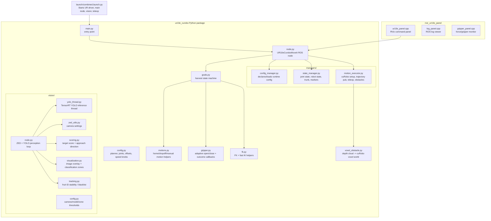
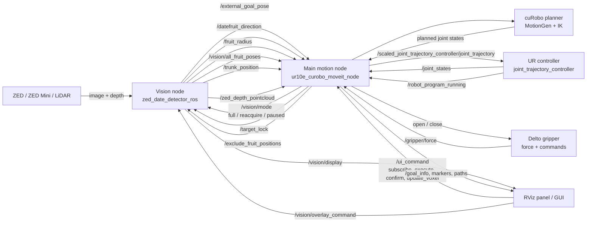
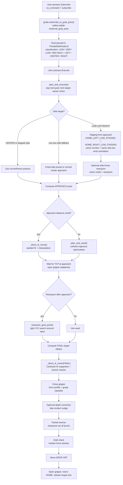
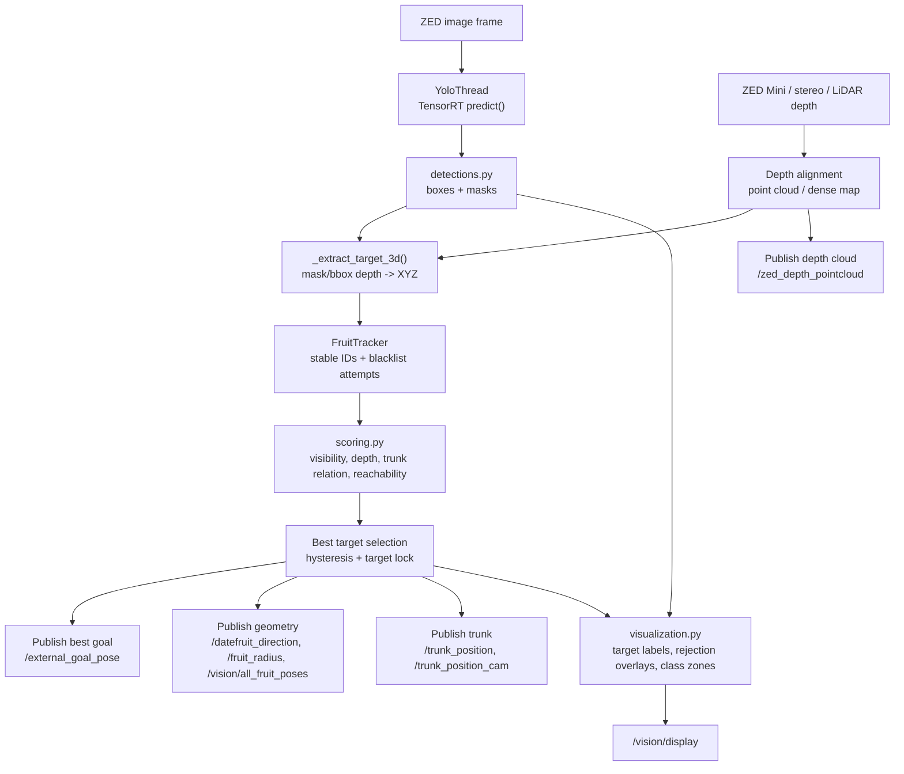

# UR10e Date Harvesting Codebase Architecture

This is a visual map of how the main pieces fit together: vision detects and localizes dates, the motion node turns selected goals into cuRobo/IK trajectories, RViz/GUI sends commands, and the gripper/force stack verifies the grasp.

## 1. Package Map



## 2. ROS Runtime Data Flow



## 3. Harvest Cycle Motion Pipeline



## 4. Vision Pipeline



## 5. Key Files By Responsibility

| Area | File | What to look for |
| --- | --- | --- |
| Main ROS node | `ur10e_curobo/node.py` | ROS pubs/subs, UI commands, goal info, voxel update, set-home-current |
| Harvest sequence | `ur10e_curobo/goals.py` | goal subscribe, classification, staging, approach, reacquire, final, reverse, dropoff |
| Planner parameters | `ur10e_curobo/config.py` | joints, offsets, staging extra, speeds, final offsets, logging knobs |
| cuRobo setup | `ur10e_curobo/managers/motion_executor.py` | MotionGen init, world config, trajectory publisher, voxel manager |
| Robot state | `ur10e_curobo/managers/state_manager.py` | joint states, robot running, trunk, fruit image metadata |
| Vision node | `ur10e_curobo/vision/node.py` | camera loop, YOLO/depth fusion, publications, reacquire/paused mode |
| YOLO thread | `ur10e_curobo/vision/yolo_thread.py` | inference model, input size, predict settings |
| Vision overlays | `ur10e_curobo/vision/visualization.py` | target drawing, classification zone overlay |
| RViz panel | `rviz_ur10e_panel/src/ur10e_panel.cpp` | buttons and `/ui_command` / overlay publishers |

## 6. Mental Model

The system has two big loops:

1. **Vision loop:** continuously detects fruit, estimates 3D position, scores candidates, and publishes the best target.
2. **Motion loop:** waits for a selected stable target, plans a staged approach, performs final TCP insertion, grasps, reverses, checks hold, and drops off.

The most important boundary is this:

```text
vision/node.py publishes facts about the scene
goals.py decides how the robot should act on those facts
motion_executor.py/cuRobo turns that decision into robot joint trajectories
```

