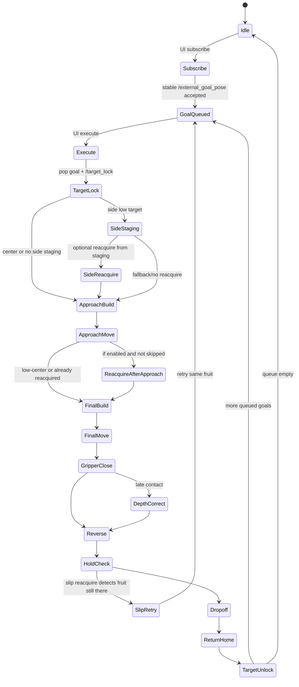
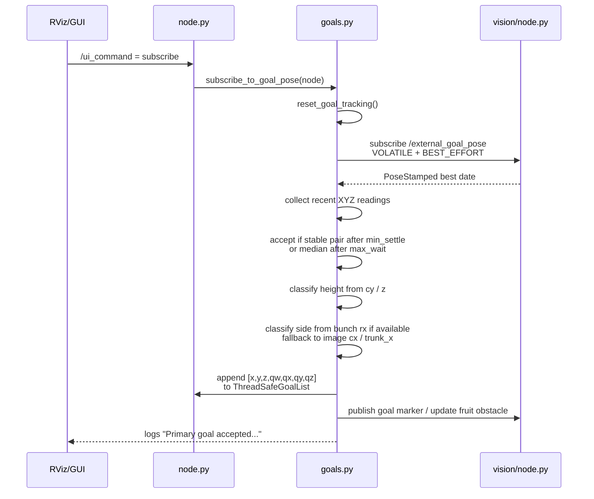
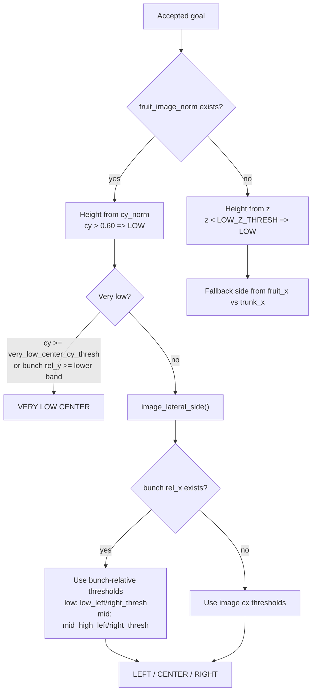
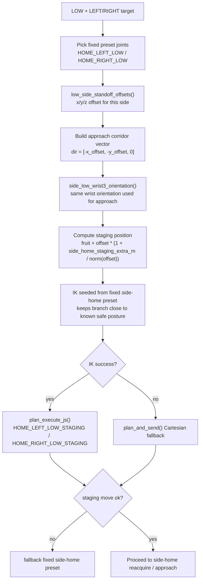
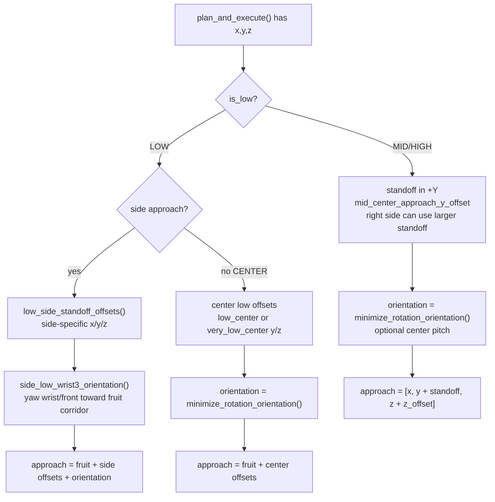
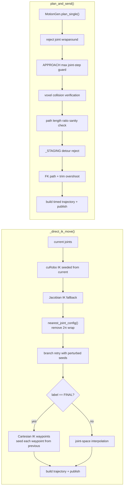
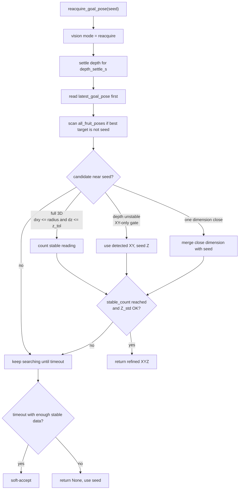
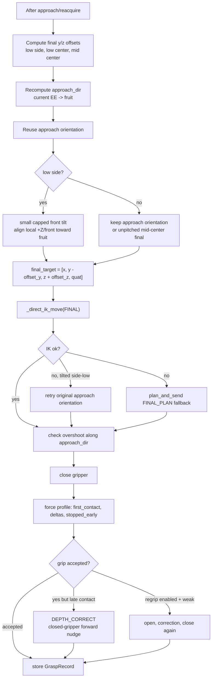
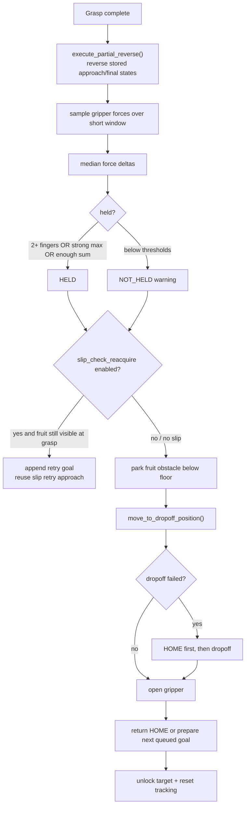

# `goals.py` Detailed Architecture

`goals.py` is the harvest state machine. It turns vision goals into a full robot behavior: accept a stable date, classify it, stage the arm, approach, reacquire, insert the TCP, grasp, reverse, verify hold, drop off, and return.

## 1. Responsibility Map

```mermaid
flowchart TB
    goals["goals.py"]

    subgraph input["Goal Input + Classification"]
        ts["ThreadSafeGoalList"]
        sub1["subscribe_to_goal_pose()"]
        subm["subscribe_multi_goals()"]
        side["image_lateral_side()<br/>LEFT / CENTER / RIGHT"]
        low["height logic<br/>LOW / VERY LOW / MID-HIGH"]
    end

    subgraph geom["Geometry + Orientation"]
        lowoff["low_side_standoff_offsets()"]
        wrist["side_low_wrist3_orientation()"]
        minrot["minimize_rotation_orientation()"]
        quat["quat_* helpers<br/>slerp, yaw, pitch, local-axis align"]
        dyn["compute_dynamic_side_home()<br/>older date-clamped helper"]
    end

    subgraph plan["Planning + Execution"]
        main["plan_and_execute()"]
        direct["_direct_ik_move()<br/>seeded IK, branch retry, Cartesian waypoints"]
        traj["plan_and_send()<br/>cuRobo plan, voxel check, path guard, trim"]
        rev["execute_partial_reverse()<br/>reverse stored approach/final states"]
        reacq["reacquire_goal_pose()<br/>tight vision search around seed"]
    end

    subgraph grasp["Grasp + Feedback"]
        lock["lock_target() / unlock_target()"]
        notify["notify_grasp_attempt()"]
        hold["after-reverse HOLD_CHECK"]
        learn["GraspRecord / learner hooks"]
    end

    goals --> input
    goals --> geom
    goals --> plan
    goals --> grasp

    sub1 --> ts
    subm --> ts
    sub1 --> side
    sub1 --> low
    main --> side
    main --> low
    main --> lowoff
    main --> wrist
    main --> minrot
    main --> direct
    main --> traj
    main --> reacq
    main --> rev
    main --> hold
    main --> lock
```



## 2. High-Level Harvest State Machine



## 3. Single-Goal Acceptance Path



Important details:

- `subscribe_to_goal_pose()` accepts one goal only.
- `subscribe_multi_goals()` can queue several score-ordered fruits from `/vision/all_fruit_poses`.
- Lateral classification prefers `fruit_bunch_rel_x` over full-image `cx`, so side zones move with the bunch.
- Very low or lower-boundary fruits can force `CENTER`.

## 4. Classification Decision Logic



## 5. Side-Low Staging From Approach

This is the newer fix for the unnatural dynamic side-home motion.



Key property:

```text
staging -> approach -> final uses the same side corridor and the same side-low wrist orientation.
```

That reduces the old problem where a dynamic side-home target was safe in XYZ but different in wrist/elbow posture.

## 6. Approach Pose Builder



## 7. Motion Planner Wrappers



Use rule:

- `_direct_ik_move()` is used for close, precise moves where branch consistency matters.
- `plan_and_send()` is used for larger global moves where cuRobo trajectory optimization is needed.

## 8. Reacquire Logic



Normal places reacquire is used:

- From side staging before approach, if side target and `reacquire_after_approach` is enabled.
- After approach, unless already reacquired or low-center skip is active.
- Optional slip check after reverse if enabled.

## 9. Final TCP Insertion + Grasp



## 10. Reverse, Hold Check, Dropoff



## 11. Helper Index

| Helper | Purpose |
| --- | --- |
| `ThreadSafeGoalList` | Safe queue for goal callbacks and execute thread |
| `lock_target()` / `unlock_target()` | Tell vision to stay on the chosen fruit during motion |
| `image_lateral_side()` | Convert image/bunch position into `LEFT`, `CENTER`, `RIGHT` |
| `is_bunch_lower_boundary()` | Force lower-bunch fruit to center/very-low behavior |
| `low_side_standoff_offsets()` | Side-specific low approach offsets |
| `side_low_wrist3_orientation()` | Adjust wrist 3 through FK to keep side-low branch consistent |
| `minimize_rotation_orientation()` | Use closest equivalent target quaternion and blend from current |
| `_direct_ik_move()` | Close-range IK motion with branch protection |
| `plan_and_send()` | Full cuRobo planning with wraparound, voxel, path-ratio, and trim checks |
| `reacquire_goal_pose()` | Lightweight vision loop for final XYZ correction |
| `execute_partial_reverse()` | Back out along stored trajectory to clear the bunch |
| `notify_grasp_attempt()` | Let vision tracking count attempts for the fruit |

## 12. Short Mental Model

```text
subscribe_to_goal_pose()
    selects one stable fruit and stores it

plan_and_execute()
    decides the route and runs the whole harvest cycle

_direct_ik_move()
    handles short precise TCP moves without wrist branch jumps

plan_and_send()
    handles larger cuRobo-optimized moves and rejects bad detours

reacquire_goal_pose()
    refreshes fruit XYZ only when the arm is already staged/settled
```

